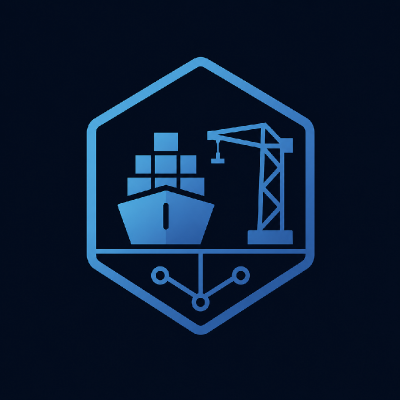

<section class="home-hero" aria-labelledby="home-title">
  
  <div class="home-hero__content">
    <p class="home-hero__eyebrow">Continuous recovery readiness</p>
    <h1 id="home-title">Storm Harbor <span>Control Plane</span></h1>
    <p class="home-hero__lead">Know what will recover before an incident.</p>
    <p class="home-hero__summary">Connect repositories, cloud infrastructure, clusters, backups, and policies in one live view. Find gaps against RTO and RPO, rehearse safely, and keep the evidence.</p>
    <div class="home-hero__actions">
      <a href="architecture/control-plane/" class="md-button md-button--primary">See how it works</a>
      <a href="operations/pipelines/" class="md-button">Explore safe simulations</a>
    </div>
    <p class="home-hero__integrations">GitHub <span aria-hidden="true">·</span> Terraform <span aria-hidden="true">·</span> Google Cloud <span aria-hidden="true">·</span> Kubernetes</p>
  </div>
</section>

<div class="home-value-grid">
  <article class="home-value-card">
    <p class="home-value-card__number" aria-hidden="true">01</p>
    <h2>See readiness now</h2>
    <p>Turn live infrastructure, dependencies, recovery targets, and test history into one clear answer.</p>
  </article>
  <article class="home-value-card">
    <p class="home-value-card__number" aria-hidden="true">02</p>
    <h2>Find blockers early</h2>
    <p>Surface stale backups, drift, broken dependencies, and policy gaps before recovery is urgent.</p>
  </article>
  <article class="home-value-card">
    <p class="home-value-card__number" aria-hidden="true">03</p>
    <h2>Prove every exercise</h2>
    <p>Capture decisions, timings, health checks, and artifacts as auditable recovery evidence.</p>
  </article>
</div>

## One operational view. No new source of truth.

Storm Harbor reads each system where it is authoritative, maps the relationships, and continuously evaluates whether services can meet their recovery objectives. Every team keeps ownership of its domain; the control plane provides the shared view.

```joint
flowchart LR
  subgraph S[AUTHORITATIVE SOURCES]
    GH[GitHub<br/>plans and desired state]
    TF[Terraform backend<br/>runtime state]
    GC[GCP APIs<br/>cloud actual state]
    KA[Kubernetes API<br/>cluster actual state]
    ES[Evidence store<br/>immutable proof]
  end

  subgraph C[DR CONTROL PLANE]
    D[Discover]
    N[Normalize]
    X[Correlate]
    P[Evaluate policy]
    O[Orchestrate]
    V[Validate and prove]
    D --> N --> X --> P --> O --> V
  end

  GH --> D
  TF --> D
  GC --> D
  KA --> D
  V --> ES

  classDef source fill:#f4f4f4,stroke:#c0000d,color:#1d1d1b,stroke-width:2px;
  classDef core fill:#fbe6e8,stroke:#e30613,color:#1d1d1b,stroke-width:2px;
  class GH,TF,GC,KA,ES source;
  class D,N,X,P,O,V core;
```

## From signal to recovery proof

1. **Observe:** discover authorized repositories, cloud assets, clusters, backups, and policies.
2. **Assess:** connect dependencies and compare current state with criticality, RTO, and RPO.
3. **Exercise:** build an immutable recovery plan and run it through approvals, guardrails, and health gates.
4. **Prove:** preserve signed results outside the recovered failure domain.

!!! info "Built for safe validation first"
    The current repository is an architecture and simulation scaffold. It validates contracts, ordering, metrics, guardrails, and evidence without credentials or changes to external resources.

## Explore by goal

| If you want to… | Start here |
| --- | --- |
| understand the product and its boundaries | [Product overview](product/overview.md) |
| see why ownership stays distributed | [Federated Source of Truth](architecture/federated-source-of-truth.md) |
| follow assets from inventory to dependency graph | [Inventory and dependencies](architecture/inventory.md) |
| understand Kubernetes recovery orchestration | [CRDs and Operator](kubernetes/crds-and-operator.md) |
| inspect safe recovery exercises | [Simulation pipelines](operations/pipelines.md) |
| measure RTO, RPO, and evidence | [Recovery evidence](operations/evidence.md) |
